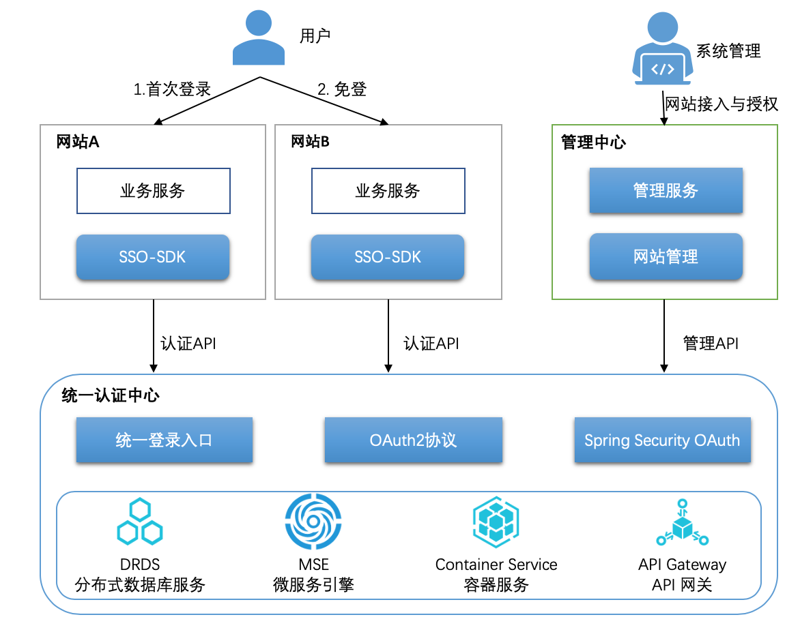
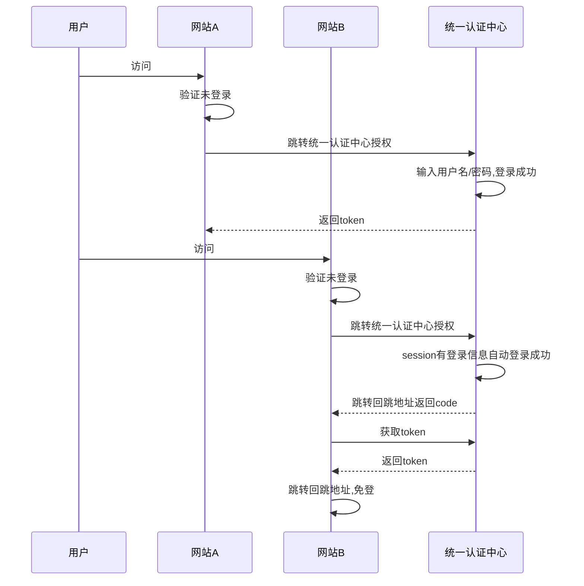
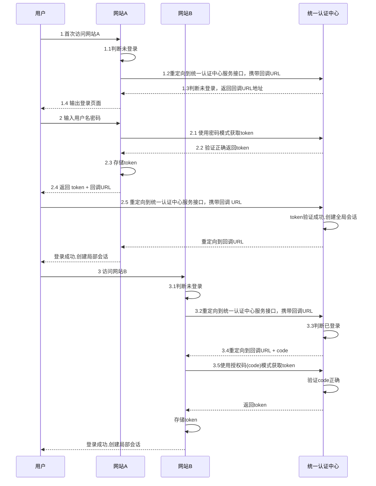

# 基于OAuth2的跨网站统一登录解决方案

## 1.需求场景

随着业务发展，一个企业开发、运营了多个网站，同时也产生了一些亟待解决的问题。

- 用户使用每个网站前，需要重复注册，需要记住对应的账号和密码。
- 用户使用每个网站时，需要一次次重新登录。
- 用户只是了解一个个独立的网站，企业没有在用户心中形成统一的形象。
- 每个产品都需要重复设计、开发和维护注册、登录等模块。
- 用户的信息分散在各个网站中，不利于更好的了解用户。

## 2.解决方案

## 2.1 方案说明

本解决方案基于OAuth2 协议，为网站用户提供跨网站的流畅登录体验，且拥有高性价比的弹性伸缩能力。

- 统一认证中心：基于 Spring Cloud Security、JWT、OAuth2 协议，提供统一认证能力，负责用户认证数据的统一管理。
- 需接入的网站：基于 SSO-SDK，轻量级接入统一认证体系，与统一认证中心协作，提供用户畅游企业各产品网站的最佳浏览体验。
- 管理中心：负责管理需接入网站的认证管理，保证统一认证体系的安全与可控。
- 关于用户的登录页，为保证用户的统一体验及统一企业品牌，推荐采用统一登录页的方案，同时支持少数网站需要自定义的特殊需求。
- 基于微服务+阿里云容器服务，提供高性价比的弹性伸缩能力。

## 2.2.方案优势

- 遵循主流的OAuth2开放协议，除能打通内部系统的用户数据外，还可在授权允许情况下，允许外部系统使用本系统的用户进行登录，如常见微信登录、QQ登录等。
- Spring Security 框架技术成熟且社区活跃，稳定性有保证。
- 在Spring Security 框架基础上，进行增强扩展，可满足密码模式下的SSO场景。
- 支持跨域单点登录。
- 基于阿里云基础设施的构建，整体系统稳定可靠。
- 充分发挥阿里云的弹性伸缩能力，即可控制成本，又可适应用户数量的爆发式增长。
- 兼顾私有云、传统 IDC 部署环境，满足不同客户的运行环境的需求。

## 3. 客户价值

基于此方案，帮助企业打通各产品的用户体系，且实现多种场景下的免登。企业拥有企业级的统一账号体系，建立统一企业品牌，提升用户注册与登录场景的体验。

- 统一的用户认证体系，实现统一认证、跨网站免登，实现 SSO。
- 统一的用户数据库，实现用户数据的聚合，帮助企业更懂用户。
- 企业级网站的统一登录页，统一品牌形象，统一用户体验。
- 支持产品根据特殊性选择自定义登录页。
- 支持用户名、手机号、邮箱等多种认证方式的扩展。

### 3.1 网站用户的收益

- 一次注册即可使用所有企业运营的产品，无需反复填写注册信息
- 一次登录即可所有企业运营的所有产品，即安全又便捷

### 3.2 企业的收益

- 降低用户试用企业运营产品的门槛，利于交叉营销。
- 减少用户反复登录，利于产品用户促活。
- 减少产品研发中的重复建设，降低成本，提升产品推进效率。
- 统一建设认证中心，便于统一和提升所有产品的账号安全。

## 4. 关于登录页的说明

### 4.1 模式一：统一登录页的SSO

此种模式无需网站实现登录页、登录接口的开发，未登录状态的用户会自动被引导到统一认证中心去登录。

#### 4.1.1 实现原理

#### 4.1.2 说明

技术实现整体使用spring-securiry-oauth2的 **“授权码模式”** 来进行实现。

### 4.2 模式二：网站自定义登录页

#### 4.2.1 实现原理

#### 4.2.2 说明

在统一认证中心与网站的实现上，除spring-securiry-oauth2之外，还需要引入云顶云研发的  **“密码模式SSO”** 扩展包来进行实现。
