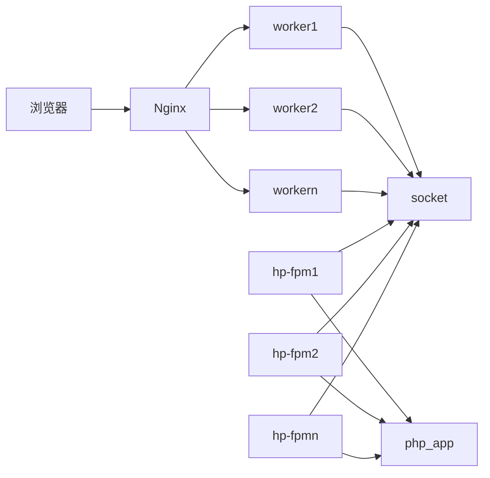

# php-fpm

## nginx优化

* worker_process：修改为内核数的1-2倍, 一般是4或8, 8以上优化不大；这里需要注意, 开太多的worker进程, 会增加cpu开销,cpu占用会增高
* keepalive_timeout：高并发下设为0；但是文件上传需要保持连接, 开发时需注意, 做好业务拆分
* worker_connections：设置worker进程最大打开的连接数, 建议尽量高,比如20480
* worker_rlimit_nofile：将此值增加到大于worker_processes * worker_connections的值。 应该是增加当前worker运行用户的最大文件打开数值

## php-fpm

* emergency_restart：
    * 60秒内有10次子进程中断,则重启php-fpm, 防止因php垃圾代码造成的中断问题`emergency_restart_threshold =10 ;emergency_restart_interval =60`
* process.max:允许的最大进程数, 一个php-fpm进程大约占用15-40m的内从, 具体设置值需要根据实际情况得出 我这里设为 512
* pm.max_children:某个连接池允许的最大子进程, 不要超过process_max
* pm.max_requests:允许的最大请求 ,设置2048
* 关掉慢请求日志:request_slowlog_timeout = 0;slowlog = var/log/slow.log

## 附常用指令

可以查看当前开启了几个fpm进程, 总内存开销, 正在处理请求的进程等。

* 确认php-fpm的worker进程是否够用，如果不够用就等于没有开启一样 
计算开启worker进程数目：

    `ps -ef | grep 'php-fpm'|grep -v 'master'|grep -v 'grep' |wc -l`

* 计算正在使用的worker进程，正在处理的请求

    `netstat -anp | grep 'php-fpm'|grep -v 'LISTENING'|grep -v 'php-fpm.conf'|wc -l`

* 内存开销

    `ps auxf | grep php | grep -v grep | grep -v master | awk '{sum+=$6} END {print sum}'`

## 扩展阅读

<https://zhuanlan.zhihu.com/p/96911584>
<https://www.php.net/manual/zh/install.fpm.php>
<https://php-fpm.org/>