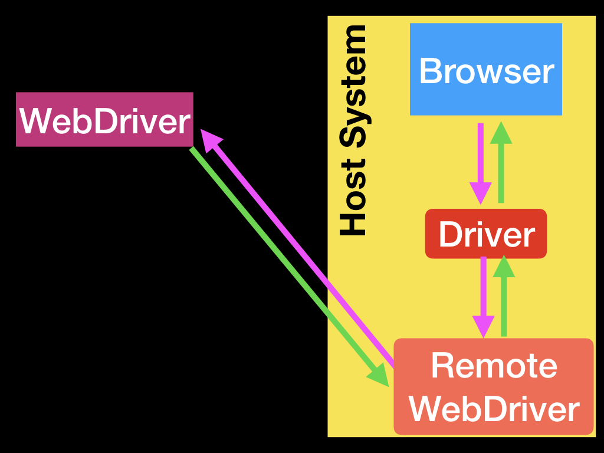
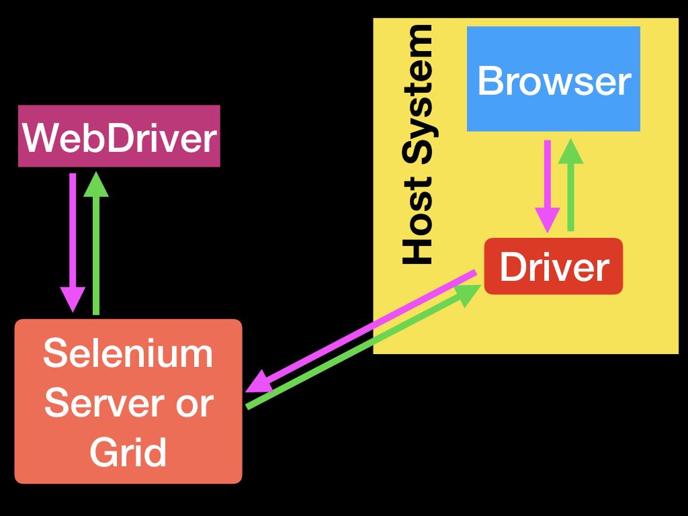
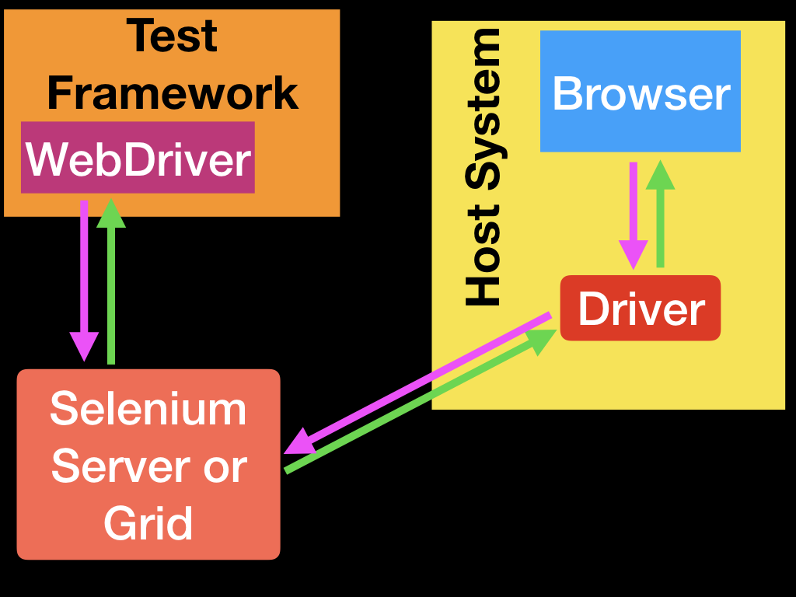

# Selenium

参考文档： <https://selenium.dev/documentation/en/>

## 1. 部署级框架

* **Selenium IDE**：浏览器插件，自动录制操作脚本（If you want to create quick bug reproduction scripts, create scripts to aid in automation-aided exploratory testing, then you want to use Selenium IDE; a Chrome and Firefox add-on that will do simple record-and-playback of interactions with the browser.）
* **Browser**：浏览器，测试用例执行器。
* **Selenium WebDriver**：浏览器驱动器，用例操作浏览器的桥梁（If you want to create robust, browser-based regression automation suites and tests, scale and distribute scripts across many environments, then you want to use Selenium WebDriver, a collection of language specific bindings to drive a browser - the way it is meant to be driven.）
* **Selenium Grid**：分布式测试解决方案（If you want to scale by distributing and running tests on several machines and manage multiple environments from a central point, making it easy to run the tests against a vast combination of browsers/OS, then you want to use Selenium Grid.）

## 2. Selenium WebDriver

### 2.1 关于Selenium WebDriver

#### Selenium WebDriver相关模块

* **API**: 用例开发直接调用的接口。Application Programming Interface. This is the set of “commands” you use to manipulate WebDriver.
* **Library**: 面向不同语言的API 的封装库。A code module which contains the APIs and the code necessary to implement them. Libraries are specific to each language binding, eg .jar files for Java, .dll files for .NET, etc.
* **Driver**: 最底层直接操作浏览器。Responsible for controlling the actual browser. Most drivers are created by the browser vendors themselves. Drivers are generally executable modules that run on the system with the browser itself, not on the system executing the test suite. (Although those may be the same system.) NOTE: Some people refer to the drivers as proxies.
    * **chromedriver**：自选部分，如使用 Chrome 浏览器。To drive Chrome or Chromium, you have to download chromedriver and put it in a folder that is on your system’s path.
* **Framework**: 自选部分。An additional library used as a support for WebDriver suites. These frameworks may be test frameworks such as JUnit or NUnit. They may also be frameworks supporting natural language features such as Cucumber or Robotium. Frameworks may also be written and used for things such as manipulating or configuring the system under test, data creation, test oracles, etc.

#### Selenium WebDriver四种应用模式

* 基本模式

* 远程模式

* 分布式模式

* 基于测试框架的模式

### 2.2 关于Remote WebDriver

You can use WebDriver remotely the same way you would use it locally. The primary difference is that a remote WebDriver needs to be configured so that it can run your tests on a separate machine.

A remote WebDriver is composed of two pieces: a client and a server. The client is your WebDriver test and the server is simply a Java servlet, which can be hosted in any modern JEE app server.

## 3. 关于 Selenium Grid

Generally speaking, there’s two reasons why you might want to use Grid.

* To run your tests against multiple browsers, multiple versions of browser, and browsers running on different operating systems.
* To reduce the time it takes for the test suite to complete a test pass.

### 3.1 Purposes and main functionalities

* Central entry point for all tests
* Management and control of the nodes / environment where the browsers run
* Scaling
* Running tests in parallel
* Cross platform testing
* Load balancing

### 3.2 [Selenium Grid](https://selenium.dev/documentation/en/grid/components_of_a_grid/)

## 4.测试用例开发框架

###  4.1 目录工程架构（仅为示意）

* 公共库文件目录
* 用例源码目录
* 用例编译结果目录
* 用例执行目录
    * 测试数据目录
    * 测试结果目录
    * 测试临时目录
    * 测试报告目录

### 4.2 用例开发框架

#### 使用 Java 开发用例

* 标准动作：
    * 框架要求的基本动作；
    * 某类测试的基本动作；
* 可选动作
    * 与具体某个测试相关的动作

## 5.应用建议

* 面向网页对象建模
* 领域特定语言Domain specific language (DSL)
* 生成应用状态
* 模拟外部系统
* 改进报告
* 避免共享状态
* 测试独立性
* 考虑引入 fluent API
* 每次测试均刷新浏览器

## 6.应用的约束条件

* 多用 id，以减少前端实现与测试用例间的耦合
* 多用 XX，以提高测试用例的稳定性

## 7.扩展阅读

<https://selenium.dev/documentation/en/introduction/types_of_testing/>
